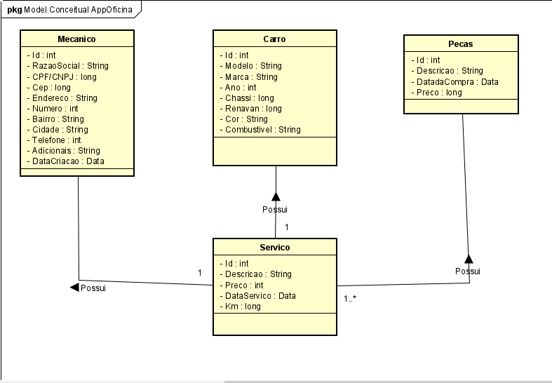

<h1 align="center">App Web OFICINA </h1>

<figure>
	
</figure>

<h2> Sobre / About</h2>

<p> Esse projeto foi desenvolvido utilizando Spring Boot para o back end e o banco de dados utilizado foi o PostgreSQL.</p>
<p> Esse App ajuda os motoristas a terem um controle das tarefas relacionadas a manutenção que foram feitas no seu carro, possibilitando informar todos os serviços que foram 
feitos no carro como troca de óleo, de bateria, de filtros de ar e óleo, a troca de pneus, alinhamento e balanceamento, entre muitos outros.</p>
<p> Com o app o motorista consegue ter um controle de quanto foi gasto no carro, e  todos os servicos que foram feitos</p>
<p> A principal função desse app é mantê-lo informado sobre a manutenção do veículo.</p>
<br>
<p>This Project was developer using Spring Boot to a back-end and DB user was the PostgreSQL.</p>
<p>This App 
help the conductors the will have control of task related the maintenance that were made in your car, making possible inform all services that were made in the car 
like a oil change, battery, air and oil filters, changing tires, alignment and balancing among others.</p>
<p>With the App the conductor can you have a controll of how much in your car and all services that were made. </p>
<p>THe function main this app is keep it information about vehicle maintenance</p>

<h2> Tecnologias utilizadas / Technologies used </h2>
<u1>
    <li><a href="https://www.oracle.com/br/java/technologies/javase-jdk11-downloads.html"> JDK 11 </a> : Java Development Kit 11 - um kit de desenvolvimento para 
    	construção de aplicações e componentes usando a linguagem de programação Java;</li>
    <li><a href="https://netbeans.apache.org/download/index.html"> NetBeans</a> : O NetBeans IDE é um ambiente de desenvolvimento integrado gratuito e de código aberto 
    	para desenvolvedores de software nas linguagens Java.</li>
    <li><a href="https://spring.io/"> Spring Boot </a> : O Spring é um framework open source para a plataforma Java criado. Trata-se de um framework não intrusivo,
    	baseado nos padrões de projeto inversão de controle (IoC) e injeção de dependência.</li>
     <li><a href="https://www.postgresql.org/download/"> PostgreSQL </a> :  PostgreSQL é um sistema gerenciador de banco de dados objeto relacional</li>
    <li><a href="https://maven.apache.org/"> Maven </a> : Apache Maven, ou Maven, é uma ferramenta de automação de compilação utilizada primariamente em projetos Java.</li>
    <li><a href="https://www.postman.com/downloads/"> Postman </a> :  Ferramenta que executa testes de APIs e requisições em geral.</li>
    <li><a href="https://www.h2database.com/html/main.htmls/"> H2 Database Engine </a> :  H2 é um sistema de gerenciamento de banco de dados relacional escrito em Java para TESTE.</li>
    <li><a href="https://www.heroku.com/"> Heroku </a> : Heroku é uma plataforma em nuvem como um serviço que suporta várias linguagens de programação.</li>
</u1> 

 <h2> Intalacao / Installation</h2>
 
  <p>Para baixar o código-fonte do projeto em sua máquina, primeiramente voce terá que ter instalado em seu computador o <a href="https://git-scm.com/"> GIT </a>.</p>
  <p>For download the source code of project in yout PC, firstly you must have install in your PC the<a href="https://git-scm.com/"> GIT </a>.</p>
  <br>
  <p>Com o Git init instalado, em seu terminal execute o seguinte comando:</p>
  <p>With the Git installed, in your terminal execute the following command:</p>
  
  ```
  $ git clone https://github.com/jonasmachados/AppWeb-Oficina.git
  ```
  <br>
  <p>Dependency to H2 Database EngineH:</p>
  
  
  ```
   <dependency>
            <groupId>com.h2database</groupId>
            <artifactId>h2</artifactId>
            <scope>runtime</scope>
   </dependency>
  ```
  <br>
  <p>Dependency to PostgreSQL:</p>
  
   ```
   <dependency>
            <groupId>org.postgresql</groupId>
            <artifactId>postgresql</artifactId>
            <scope>runtime</scope>
  </dependency>
  ```
  <h2> Author: </h2>
      <b>Jonas Machado</b>
  
